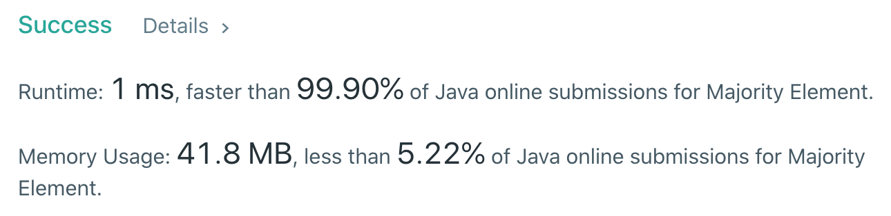

Boyer Moore majority voting algorithm is a very popular algorithm for calculating the majority element in an array. Finding the majority element in an array can be done in several different ways, but the most efficient way is to use the Boyer-Moore algorithm.

## Basic Idea

Imagine that you have a non-sorted list of values of size 'n'. You want to know if there is a value in the array that appears in the list for more than half of the elements in that list (or more than n/2). If the value exists, we return the value.

## Approach

With Boyer Moore's Voting algorithm, we initialize two variables `candidate` and `count`. Our candidate is responsible for keeping track of the maximum element we have seen so far. While, count is the number of times we have seen the candidate as we iterate over the array (consequently). By the end of looping, whatever is assigned to our candidate variable will be the majority element.

This algorithm allows us to solve the problem in linear time and constant space where N is the number of elements we have in our array. Since we only touch each index in our array a single time, the algorithm will always run in big O(N).

## Boyer Moore's Algorithm

In the first pass, we generate a single candidate value which is the majority value if there is a majority.

The second pass simply counts the frequency of that value to confirm. The first pass is the interesting part.

In the first pass, we need 2 values:

- A candidate value, initially set to any value.
- A count, initially set to 0.
- For each element in our input list, we first examine the count value. If the count is equal to 0, we set the candidate to the value at the current element. Next, first compare the element's value to the current candidate value. If they are the same, we increment count by 1. If they are different, we decrement count by 1.

### Pseudocode

```javascript
candidate = 0
count = 0
for value in input:
  if count == 0:
    candidate = value
  if candidate == value:
    count += 1
  else:
    count -= 1
```

At the end of traversing through all of the inputs, the candidate variable will hold the majority value if it exists.

## Majority Element on Leetcode #169

Now let us solve Problem Number 169 (Majority Element) on Leetcode using Boyer-Moore's voting algorithm.

## Problem Statement

Given an array of size n, find the majority element. The majority element is the element that appears more than ⌊ n/2 ⌋ times.

> You may assume that the array is non-empty and the majority element always exist in the array.

**Example 1:**

```java
Input: [3,2,3]
Output: 3
```

**Example 2:**

```java
Input: [2,2,1,1,1,2,2]
Output: 2
```

## Solution (Java Code):

#### `TIME - O(N)` | `SPACE - O(1)`

The basic idea behind this approach is that we take into account two variables `count` and `candidate`. Looping through the nums array we check if count == 0 (for the very first element), meaning we encounter the very first element in the array.

And for the subsequent values in the array, we check if the element that appeared is same as the value in the candidate, if yes, we increment the count, if not we decrement the count.

```java
class Solution {
    public int majorityElement(int[] nums) {
        int count = 0; int candidate = 0;

        for (int element : nums){
            if (count == 0) candidate = element;
            if (candidate == element) ++count;
            else --count;
        }

        return candidate;
    }
}
```

The Boyer-Moore Voting Algorithm is pretty fast and consumes no extra space as we can see in the result below:



## Complete Implementation

The complete implementation of Boyer Moore's Voting Algorithm in Java can be found below:

```java

class Main {
    void printMajority(int a[], int size)
    {
        int candidate = findCandidate(a, size);

        if (isMajority(a, size, candidate))
            System.out.println(" " + candidate + " ");
        else
            System.out.println("Majority Element not found!");
    }

    int findCandidate(int a[], int size)
    {
        int majority_index = 0, count = 1;
        int i;
        for (i = 1; i < size; i++) {
            if (a[majority_index] == a[i])
                count++;
            else
                count--;
            if (count == 0) {
                majority_index = i;
                count = 1;
            }
        }
        return a[majority_index];
    }

    boolean isMajority(int a[], int size, int candidate)
    {
        int i, count = 0;
        for (i = 0; i < size; i++) {
            if (a[i] == candidate)
                count++;
        }
        if (count > size / 2)
            return true;
        else
            return false;
    }

    /* Driver code */
    public static void main(String[] args)
    {
        MajorityElement majorelement
            = new MajorityElement();
        int a[] = new int[] { 1, 2, 2, 1, 2 };

        int size = a.length;
        majorelement.printMajority(a, size);
    }
}

```

## Conclusion

Boyer Moore's Voting algorithm to find the majority element in an array is very handy as it deprecates the need to use HashMap or an extra space to find the majority element that we would normally go for.
