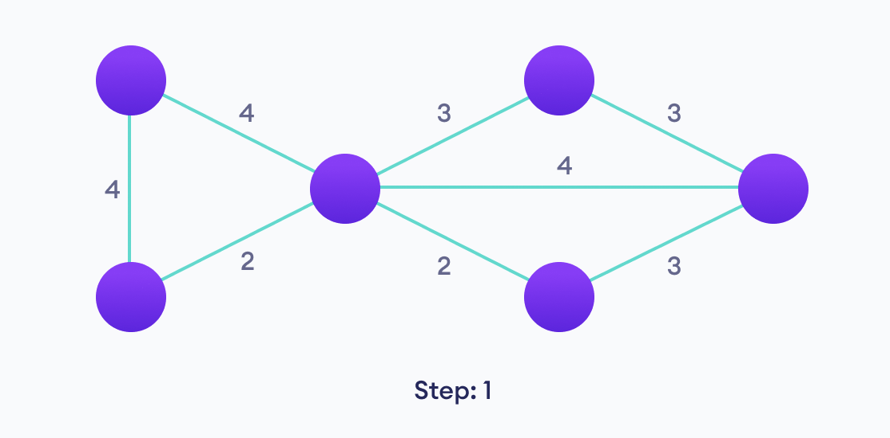
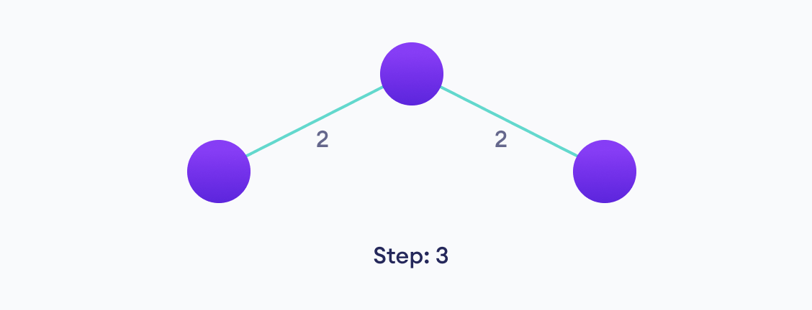
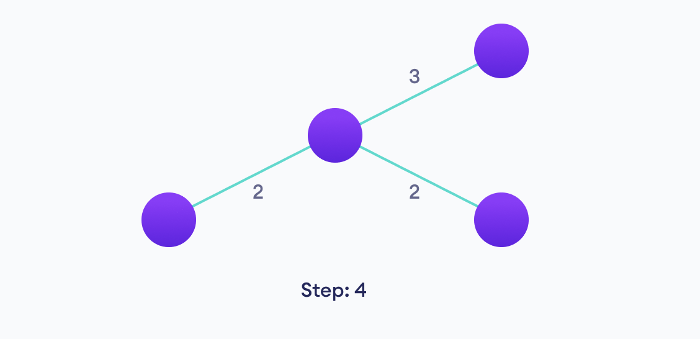
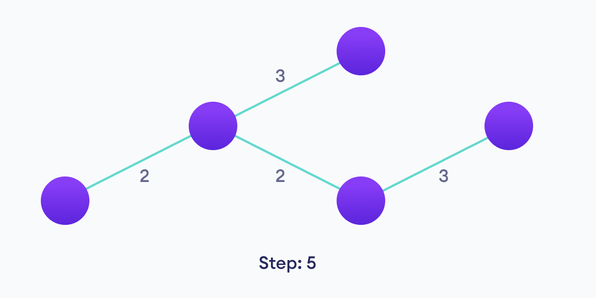
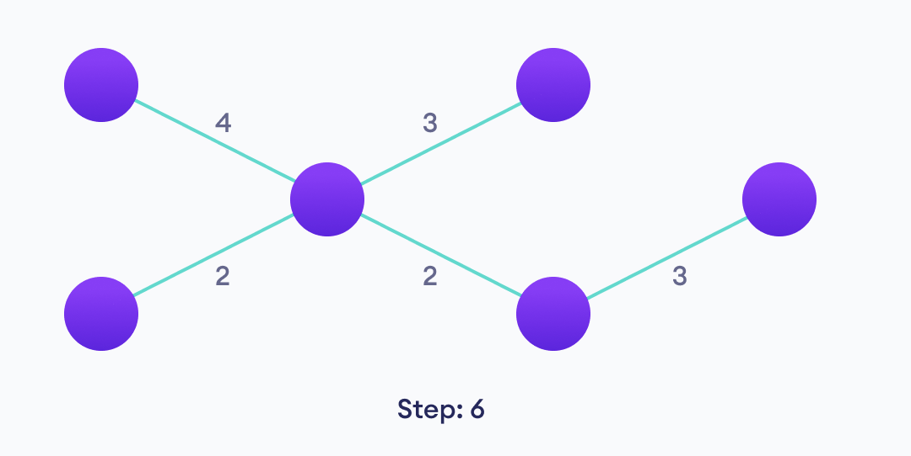

> Kruskal's algorithm finds a minimum spanning forest of an undirected edge-weighted graph. If the graph is connected, it finds a minimum spanning tree.

⦾ [Wikipedia](https://en.wikipedia.org/wiki/Kruskal's_algorithm)

## What is a spanning tree ?

A spanning tree is a subset of Graph G, which connects all the vertices with minimum possible number of edges connected. A spanning tree cannot have cycles and it cannot be disconnected as well.

## And what is a minimum spanning tree ?

A minimum spanning tree (MST) or minimum weight spanning tree is a subset of a (connected, edge-weighted, undirected) Graph G that connects all the vertices together.

Minimum spanning tree can't form any cycles and they also have to take care of the total edge weight. The total edge weight has to be minimum in the case of minimum spanning tree.

That is, it is a spanning tree whose sum of edge weights is as small as possible.

## How Kruskals algorithm works:

Kruskals algorithm falls under the class of greedy algorithms. A greedy algorithm basically finds the optimal choice at each step as it attempts to find the overall optimal way to solve the entire problem.

We start from the edges with the lowest weight and keep adding edges until we reach the goal of finding a route through each of these vertices.

The steps for implementing Kruskal's algorithm are as follows:

- Sort all the edges from low weight to high
- Take the edge with the lowest weight and add it to the spanning tree. If adding the edge created a cycle, then reject this edge.
- Keep adding edges until we reach all vertices.

<br/>

Now, let us visualize Kruskal's algorithm using a diagramatic representation:

<br/>



<br/>

- Kruskals algorithm allows us to select the edge with the minimum weight.
- So we select the minimum weighted edge i.e., the edge with weight 2 in the diagram.
- As we can see we have two edges with weight '2', we select any one.

<br/>


<br/>

- Since the other '2' is now the next minimum we select that edge.

<br/>



<br/>

- We have the edge having weight '3' as the next minimum, so we select it.

<br/>



<br/>

- We have another edge having weight '3' as the next minimum, so we select it.

<br/>



<br/>

- Now as we can see including the third '3' gives us a cycle, so we exclude it and don't consider in making the minimum spanning tree.

<br/>



<br/>

- Out of the any two '4' we can select any one of them, and we also observe that including the second '4' will lead us to a cycle and hence we ignore the second '4'.

<br/>

And now we have connstructed a Minimum Spanning Tree using Krushkal's algorithm with a total weight of (4 + 3 + 3 + 2 + 2) = 13 which is the mininmum possible.

## Pseudocode:

Minimum Spanning Tree will always exclude edges that forms a loop. We us the Union-Find algorithm which essentially divides the vertices into clusters and allows us to check if two vertices belong to the same cluster or not and hence decide whether adding an edge creates a cycle.

```javascript
KRUSKAL(G):
A = ∅
For each vertex v ∈ G.V:
    MAKE-SET(v)
For each edge (u, v) ∈ G.E ordered by increasing order by weight(u, v):
    if FIND-SET(u) ≠ FIND-SET(v):
    A = A ∪ {(u, v)}
    UNION(u, v)
return A
```

<br/>

## References:

⦾ [Programiz](https://www.programiz.com/dsa/kruskal-algorithm)
