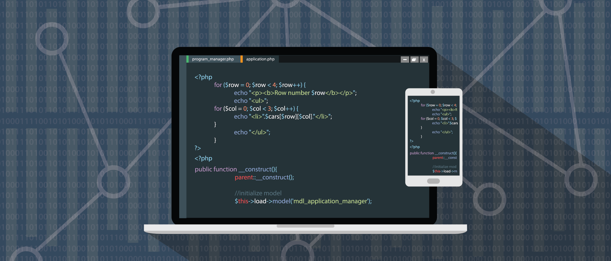
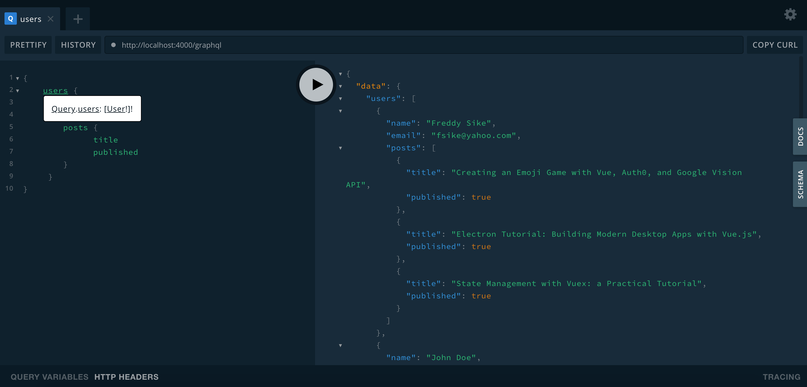
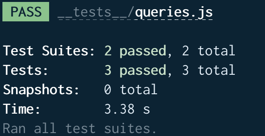

GraphQL API's are rapidly overtaking REST architectural API's as a preferred alternative providing flexibility and to keep up with the rapidly changing requirements of the clients that access them. The advantage of querying through a single endpoint has been a major uplift in case of GraphQL API's.

Today we will look to build a GraphQL API service and test the API using the graphql-playground-middleware-express available for us as an npm package.

Before we begin, please make sure you have Node.js installed on the system already. You can confirm it by running `node -v` command on your terminal.

## Setting up the GraphQL server

We set up a basic GraphQL server using Node.js. You can create a folder for this particular project by running the following command:

```bash
mkdir graphql-api-testing
```

Get into the directory:

```bash
cd graphql-api-testing
```

and then run the following command to quickly spin up the package.json file:

```bash
npm init -y
```

This will quickly scaffold a basic package.json file.

To successfully set up the GraphQL server, we will need the following npm packages:

- [express](https://www.npmjs.com/package/express): To create an ExpressJS node application.
- [graphql](https://www.npmjs.com/package/graphql): GraphQL npm package for Node.js
- [express-graphql](https://github.com/graphql/express-graphql): ExpressJS middleware for GraphQL.

Once we are done with installing the packages we can continue for the better part.

We will be building an API very similar to that of a blog, that has users and every user has some kind of blogposts.

## Defining GraphQL Schema

Let’s design the shape of the data graph by designing the schema.

At the root of your project, create a directory named `/src`; where most of the application logic code will reside.

Inside the src folder, create a file named `schema.js` and place the following code in it:

```javascript
/* src/schema.js */

const { buildSchema } = require('graphql')

const schema = buildSchema(`
    type Query {
        users: [User!]!,
        user(id: Int!): User!
    }

    type User {
        id: ID!
        name: String!
        email: String
        posts: [Post!]
    }

    type Post {
        id: ID!
        title: String!
        published: Boolean!
        link: String
        author: User!
    }
`)

module.exports = schema
```

Here we have defined the two custom types: One is the User and the other one is Post. User for all the users in a blog and Post for their respective posts.

Additionally, we also define the Query type. We can basicallt return all the users using the users query and also can return a single user with an id using the user query.

## Mock JSON data

We create an instance of the MongoDB database using the mongodb-memory-server. That will allow us to create and use an in-memory instance of MongoDB.

We require a few packages before we keep running. Let’s install them by running the following commands:

```bash
npm install --save mongodb mongodb-memory-server
```

```bash
npm install --save mongodb mongodb-memory-server
```

Now create a file that will mock our data. We call this file `data.js` inside the src folder.

```javascript
/** src/data.js **/

const Users = [
  {
    id: 1,
    name: 'Fikayo Adepoju',
    email: 'fik4christ@yahoo.com',
    posts: [
      {
        id: 1,
        title: 'Creating an Emoji Game with Vue, Auth0, and Google Vision API',
        published: true,
        link:
          'https://auth0.com/blog/creating-an-emoji-game-with-vue-auth0-and-google-vision-api/',
        author: 1,
      },
      {
        id: 2,
        title: 'Electron Tutorial: Building Modern Desktop Apps with Vue.js',
        published: true,
        link:
          'https://auth0.com/blog/electron-tutorial-building-modern-desktop-apps-with-vue-js/',
        author: 1,
      },
      {
        id: 3,
        title: 'State Management with Vuex: a Practical Tutorial',
        published: true,
        link:
          'https://auth0.com/blog/state-management-with-vuex-a-practical-tutorial/',
        author: 1,
      },
    ],
  },
  {
    id: 2,
    name: 'John Doe',
    email: 'john@company.com',
    posts: [
      {
        id: 4,
        title: 'Build a CI powered RESTful API with Laravel',
        published: true,
        link:
          'https://circleci.com/blog/build-a-ci-powered-restful-api-with-laravel/',
        author: 2,
      },
      {
        id: 5,
        title: 'Automate your Nuxt.js app deployment',
        published: true,
        link: 'https://circleci.com/blog/automate-your-nuxt-js-app-deployment/',
        author: 2,
      },
    ],
  },
  {
    id: 3,
    name: 'Jane Paul',
    email: 'jane@company.com',
    posts: [],
  },
]

module.exports = {
  Users,
}
```

The data file will export an array of users with their post data. This data will eventually be bootstraped in the in-memory MongoDB instance.

Now we take the step further and set up the database instance using the mongodb-memory-server package. Make sure you create a file named `database.js` in the src folder and place the following code in it.

```javascript
/* src/database.js */

const { MongoMemoryServer } = require('mongodb-memory-server')
const { MongoClient } = require('mongodb')
const data = require('./data')

let database = null

const mongo = new MongoMemoryServer()

async function startDatabase() {
  const mongoDBURL = await mongo.getConnectionString()
  const connection = await MongoClient.connect(mongoDBURL, {
    useNewUrlParser: true,
  })

  //Seed Database
  if (!database) {
    database = connection.db()
    await database.collection('users').insertMany(data.Users)
  }

  return database
}

async function stopDatabase() {
  await mongo.stop()
}

module.exports = {
  startDatabase,
  stopDatabase,
}
```

In the file above, we export a `startDatabase` function that sets up our in-memory MongoDB database.

It will do couple of checks. First it will check if an instance of the database already exists. If it doesn’t, it bootstraps it with the data we defined in the data.js file.

## Defining Resolvers

The next thing we got to tackle are the resolvers to our queries. This resolvers usually facilitate the queries we defined earlier to retrieve a single user using an ID or return a whole bunch of users.

Within the src folder, create a file named `resolvers.js` and place in the following code.

```javascript
/* src/resolvers.js */

const resolvers = {
  users: async (_, context) => {
    const { db } = await context();
    return db
      .collection("users")
      .find()
      .toArray();
  },
  user: async ({ id }, context) => {
    const { db } = await context();
    return db.collection("users").findOne({ id });
  }

};

module.exports = resolvers;
```

We have now successfully defined and exported the resolvers — one for each of our queries.

## Application ready for tests

We are setting up tests before we hook up the GraphQL server to start receiving requests.

```javascript
const express = require('express')

const app = express()

const port = process.env.PORT || '4000'

app.listen(port)

console.log(`🚀 Server ready at http://localhost:${port}/graphql`)
```

To be able to test the GraphQL endpoints, one file should hold all the server logic, and another file should start the application.

And only then we have a way so we can import our server into the test files and run the appropriate tests.

Go ahead and install the graphql-playground-middleware-express module, that will enable us to test the GraphQL endpoints:

```bash
npm install graphql-playground-middleware-express
```

Now, let’s create the files for GraphQL server. Within the src folder, create a file named server.js and place the following code in it.

```javascript
/** src/server.js **/

const express = require('express')
const graphqlHTTP = require('express-graphql')
const schema = require('./schema')
const resolvers = require('./resolvers')
const { startDatabase } = require('./database')
const expressPlayground = require('graphql-playground-middleware-express')
  .default

// Create a context for holding contextual data (db info in this case)
const context = async () => {
  const db = await startDatabase()

  return { db }
}

const app = express()

app.use(
  '/graphql',
  graphqlHTTP({
    schema,
    rootValue: resolvers,
    context,
  })
)

//Graphql Playground route
app.get('/playground', expressPlayground({ endpoint: '/graphql' }))

module.exports = app
```

In the file above, we have set up the Node.js application, the GraphQL context to contain an instance of our in-memory database, and the servers' GraphQL endpoint, and GraphQL playground endpoint.

The next step is to create the file to start the application server. Create a file named index.js and place the following code in it.

```javascript
/** src/index.js **/

const app = require('./server')

const port = process.env.PORT || '4000'

app.listen(port)

console.log(`🚀 Server ready at http://localhost:${port}/graphql`)
```

We have our application ready to run. Let’s add a start script to package.json to run the application.

```bash
/** package.json **/
...
“scripts” : {
“start” : “node src/index.js”
}
```

Now we just to run the app using the following command:

```bash
npm run start
```

You will now see a success message logged to your console. To test that the server is running, navigate to http://localhost:4000/playground to open up the playground. In the query window of the playground, run the following query:

```javascript
{
    users {
        name
        email
        posts {
            title
            published
        }
    }
}
```

Now you should have the output as shown below:



We can now confirm that our GraphQL Endpoints are running successfully!

## Setting the custom testing scripts: Final Part

We would like to add some tests to our application. Before that, we need to install a testing framework. The framework we will be using is `Jest`.

We require another library to test our HTTP endpoints, and for that we have the Supertest library available for us as an npm package.

We will be incorporating the Jest testing framework with the supertest HTTP testing library to test our GraphQL server.

Let’s install these two libraries as development dependencies to get started:

```bash
npm install --save-dev jest supertest
```

We can now begin writing our tests.

Jest tests can be grouped in a special folder named **\_\_tests\_\_** (double underscores on each side). Create this folder at the root of your project.

Create a sample test in this folder by creating a file named sample.js and add the following test to it.

```javascript
test("A sample test", () => {
expect(2).toBe(2);
});
```

Next, install Jest globally by running this command:

```
npm install jest --global
```

Now we are all good to run the jest command at the root of the project. That should run the test and output success messages onto the console.

And now we are confirmed that Jest is running fine as it should.

We will be creating another test suite to test our queries. This will test the users query and check that it returns the appropriate status code, data type, and number of users.

Create a file named queries.js inside the **\_\_tests\_\_** folder and place in the following code:

```javascript
const app = require('../src/server')
const supertest = require('supertest')
const { stopDatabase } = require('../src/database')

const request = supertest(app)

afterAll(async () => {
  await stopDatabase()
})

test('fetch users', async done => {
  request
    .post('/graphql')
    .send({
      query: '{ users{ id, name} }',
    })
    .set('Accept', 'application/json')
    .expect('Content-Type', /json/)
    .expect(200)
    .end(function(err, res) {
      if (err) return done(err)
      expect(res.body).toBeInstanceOf(Object)
      expect(res.body.data.users.length).toEqual(3)
      done()
    })
})
```

In the file above, we imported our server and used it to set up a request object with supertest. This allows supertest to internally bind the server to a port.

A subsequent query to our `/graphql` endpoint through a POST request is send.
Once we receive a response, Jest checks for appropriate status code, and the expected data type of the output.

Now, let’s just set up the test script to run our tests for the final time. Just below the start script in package.json, create another script named test to run the jest command as shown below:

```bash
...
“scripts”: {
“start”: “node src/index.js”
“test”: “jest”
}
```

Now you can run the following command to run the test we just added:

```bash
npm run test
```

And finally, you should see a screen similar to the one below in your console if everything is right by this time.


