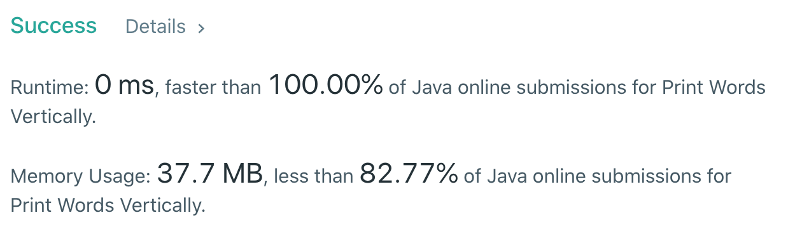

Today we will look to solve a medium-level coding question that has been asked at tecnical interviews very frequently.

Before we jump into coding let us understand the problem statement.

## Problem Statement:

**Given a string s. Return all the words vertically in the same order in which they appear in s. Words are returned as a list of strings, complete with spaces when is necessary. (Trailing spaces are not allowed). Each word would be put on only one column and that in one column there will be only one word.**

**Example 1:**

```java
Input: s = "HOW ARE YOU"
Output: ["HAY","ORO","WEU"]

Explanation: Each word is printed vertically.
 "HAY"
 "ORO"
 "WEU"
```

**Example 2:**

```java
Input: s = "TO BE OR NOT TO BE"
Output: ["TBONTB","OEROOE","   T"]

Explanation: Trailing spaces is not allowed.
"TBONTB"
"OEROOE"
"   T"
```

**Example 3:**

```java
Input: s = "CONTEST IS COMING"
Output: ["CIC","OSO","N M","T I","E N","S G","T"]
```

**_Constraints:_**

- 1 <= s.length <= 200
- s contains only upper case English letters.
- It's guaranteed that there is only one space between 2 words.

## Solution (JAVA Code)

Notice we implement two helper functions namely **_"trimRight"_** and **_"getMaxLength"_**.

- <u>**trimRight**</u> : trims the trailing spaces as mentioned in the problem statement.
- <u>**getMaxLength**</u> : returns the length of the word with maximum length;

#### `TIME - O(M * N)` | `SPACE - O(N)`

```java
class Solution {
    public List<String> printVertically(String s) {
        // return a list of strings
        List<String> result = new ArrayList<String>();

        // extract all the words in the string s
        // split between spaces
        // wordsBefore = ["HOW ARE YOU"]
        // wordsAfter = ["HOW", "ARE", "YOU"]
        String[] words = s.split(" ");

        // store the maxLength
        int maxWordLength = getMaxLength(words);

        // iterate each word through maxWordLength
        for (int i = 0; i < maxWordLength; i++){
            // structure to build the string vertically
            StringBuilder sb = new StringBuilder();

            // loop over all the words
            for (String word : words){
                if (i >= word.length()) sb.append(" ");
                else sb.append(word.charAt(i));
            }

            // trim the word and add it to the result
            result.add(trimRight(sb.toString()));
        }

        // finally return the result
        return result;

    }

    // trim the trailing white spaces
    private String trimRight(String word){
        int i = word.length();
        while (--i >= 0){
            // run from the back of the word
            // when we see an index without a space
            // we only return its first half to the index without the space
            if (word.charAt(i) != ' ') return word.substring(0, i+1);
        }
        return null;
    }

    // helper function to return the length of the longest word
    private int getMaxLength(String[] words) {
        int max = 0;

        // iterate through each word
        // and find the max
        for (String word : words){
            max = Math.max(max, word.length());
        }

        // return the max
        return max;
    }
}
```

The result that we finally return is an **ArrayList** of strings printed vertically.

## Submission Details


