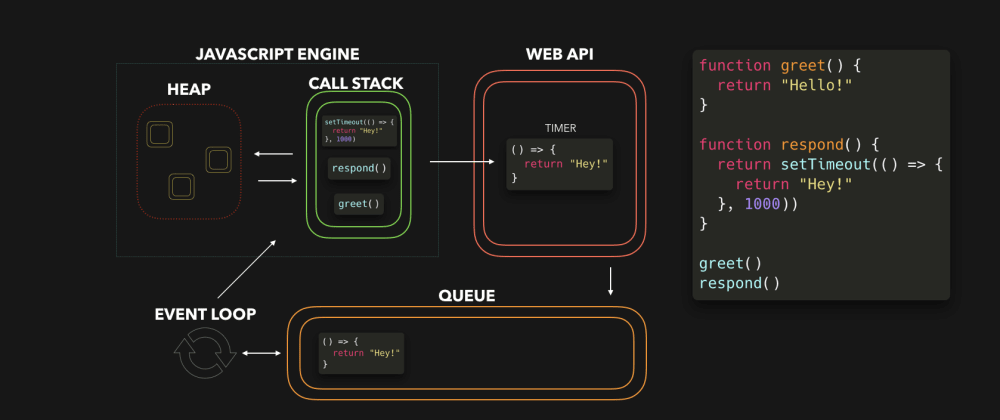

I remember the first time I was introduced to Event Loop, I was bewildered and knew nothing about it. And not knowing Event Loop when you write JavaScript code often is a big NO!

Event loop is essentially the essence behind JavaScript's asynchronous programming. This post will try to explain you Event Loop in the easiest way possible.

## Topics

- <a href="#introduction">Introduction</a>
- <a href="#architecture">Basic Architecture</a>
- <a href="#example">Simple Event Loop Example</a>

## <div id="introduction">Introduction</div>

The event loop allows non-blocking I/O operations — despite the fact that JavaScript is single-threaded. This is done by offloading running services and operations to the kernel whenever possible.

Since most modern kernels are multi-threaded, they can handle multiple operations executing in the background.

When one of these operations completes, the kernel sends a callback that gets added to the queue to eventually be executed.

We'll dive deeper into this in later part of the topic.

## <div id="architecture">Basic Architecture</div>



- <u><i>Heap</i></u> - Objects are distributed and stored in heap with no particular order. Heap is essentially a place in the memory where variables that we define are stored.

<br/>

- <u><i>Stack</i></u> - Stacks holds the neccessary function calls for execution. Every new function call, is pushed onto the stack.

<br/>

- <u><i>Web APIs</i></u> - Browsers have pre-defined API’s that developers use to perform complex processes. They are built into your web browser.
  - **For example**, the Geolocation API provides JavaScript constructs for retrieving location information and plot it on a Google Map.
  - Under the hood, the browser is essentially using low-level code to interface with the device’s GPS hardware, to retrieve the data.

<br/>

- <u><i>Callback Queue</i></u> - When a process is done executing, it is placed in a callback queue. The processes waits in the queue until the stack is empty. Once the stack is empty, processes are removed from the queue and pushed into the stack.

## <div id="example">Simple Event Loop</div>

Let us figure out what gets logged into the output with the following code:

```javascript
const foo = () => console.log('First')
const bar = () => setTimeout(() => console.log('Second'), 500)
const baz = () => console.log('Third')

bar()
foo()
baz()
```

### Output :


Let us quickly go through what happens at each step:

1. We invoke 'bar'. 'bar' in turn returns a 'setTimeout' function.
2. The callback passed to 'setTimeout' gets added to the Web API, the 'setTimeout' function and 'bar' get popped off the callstack.
3. The timer runs, meanwhile 'foo' gets invoked and logs First. 'foo' returns (undefined), 'baz' gets invoked, and the callback gets added to the queue.
4. 'baz' logs Third. The event loop sees the callstack is empty after 'baz' returned, after which the callback gets added to the call stack.
5. The callback logs Second.

<br/>

To visualize Event Loop better I would suggest you to visit [Loupe](http://latentflip.com/loupe/?code=JC5vbignYnV0dG9uJywgJ2NsaWNrJywgZnVuY3Rpb24gb25DbGljaygpIHsKICAgIHNldFRpbWVvdXQoZnVuY3Rpb24gdGltZXIoKSB7CiAgICAgICAgY29uc29sZS5sb2coJ1lvdSBjbGlja2VkIHRoZSBidXR0b24hJyk7ICAgIAogICAgfSwgMjAwMCk7Cn0pOwoKY29uc29sZS5sb2coIkhpISIpOwoKc2V0VGltZW91dChmdW5jdGlvbiB0aW1lb3V0KCkgewogICAgY29uc29sZS5sb2coIkNsaWNrIHRoZSBidXR0b24hIik7Cn0sIDUwMDApOwoKY29uc29sZS5sb2coIldlbGNvbWUgdG8gbG91cGUuIik7!!!PGJ1dHRvbj5DbGljayBtZSE8L2J1dHRvbj4%3D). It has an amazing interface to look through how Event Loop works out.
