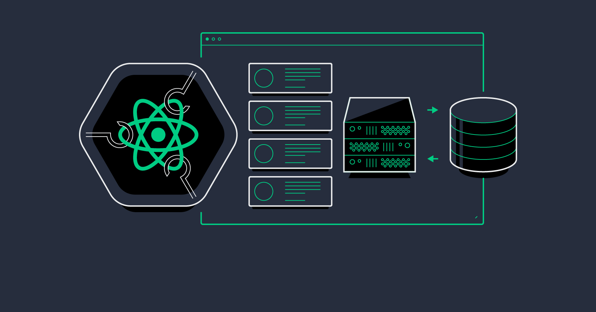

- Image Courtesy : [Toptal](https://www.toptal.com/react-hooks/stale-while-revalidate)

<br/>

SWR or stale-while-revalidate helps developers to immediately load cached data and ensure freshness of the data by updating the cached content later. Basically, SWR is a strategy to first load the data from cache (stale), send the fetch request (revalidate or update existing data), and finally update the stale data with the new data.

With SWR, React components will receive stream of data updates almost instantly improving UI experience drastically with fast and reactive updates.

## Overview

```javascript
// importing SWR module
import useSWR from 'swr'
// fetcher functionn

const fetcher = async path => {
  const res = await fetch(path)

  return res.json()
}

function Cats() {
  const { data, error } = useSWR('/api/cats', fetcher)

  if (error) return <div>Failed to load cats!</div>
  if (!data) return <div>Loading Cats.</div>
  return <div>Hi {data.name}!</div>
}
```

In the above example, the useSWR hook accepts two parameters, a key string or a path and a fetcher function. Key is basically the path to where you fetch the data from which will be passed to fetcher as an argument. Eventually the fetcher function is involved in return the essential data.

The hook typically returns two different values: data and error, based on the status of the request.

## Data Fetching using SWR

```javascript
{ data, error } = useSWR(key, fetcher)
```

This is how we implement an SWR. useSWR hook accepts two parameters. Firstly it takes the key (or any other API) and secondly the fetcher function takes care of utilising the key provided and returning the data.

### An Example

`/fetchingdata/pages/index.js`

```javascript {22}
// importing libraries
import useSWR from 'swr'
import fetch from 'unfetch'

const fetcher = async path => {
  const res = await fetch(path)

  return res.json()
}

const Profile = () => {
  const { data, error } = useSWR('/api/users/1', fetcher)

  if (error) {
    return <div>Failed to load user.</div>
  }

  if (!data) {
    return <div>Loading user data...</div>
  }

  return <div>Hello {data.name}!</div>
}

export default Profile
```

In the above file, useSWR hook accepts the key as the first argument and the fetcher function as the second argument. Essentially it is hitting the endpoint designated by the key (/api/users/1) for the data. The fetcher function than successfuly hits the endpoint and displays the data as a div element (highlighted line) on successful data retrieval.

`/fetchingdata/pages/api/users/[id].js`

```javascript
export default (req, res) => {
  const {
    query: { id },
  } = req

  res.status(200).json({
    email: 'me@leerob.io',
    id,
    name: 'Boro',
  })
}
```

The file above is the data endpoint that fetcher function hits to retrieve the desired data. The file sends a response as a json with status of 200 response indicating that the request was a success.

## Some notable SWR Features

With minimal code, developers can now take complete advantage of SWR with the amazing features out-of-the-box listed below:

- Jamstack oriented - Take advantage of core principles including pre-rendering, and decoupling along with SWR's lightning speed data availability.
- Fast, lightweight and reusable data fetching
- Built-in cache and request deduplication
- Transport and protocol agnostic
