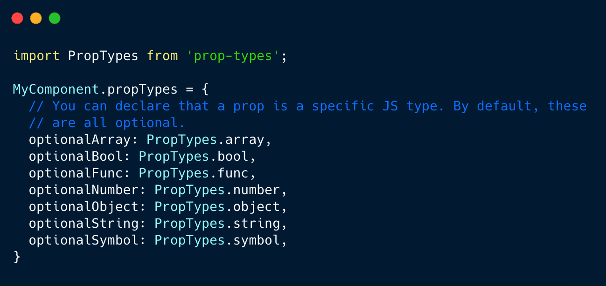
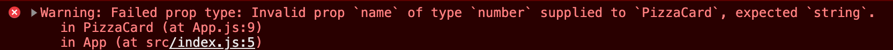

Type-checking is a very essential practice that lets us handle bugs gracefully. React has a really great built-in typechecking ability. To enable typechecking on the props in a component, you can assign the special propTypes property, like so:

```javascript
import PropTypes from 'prop-types'

class TypeChecking extends React.Component {
  render() {
    return <h1>I am being, {this.props.typechecked}</h1>
  }
}

Greeting.propTypes = {
  typechecked: PropTypes.string,
}
```

PropTypes are an ability to ensure that components are passed with appropriate data types. They can export a wide range of validators that can be used to make sure the data you receive is valid.

Suppose, if a component expects to receive a string data type in one of its props, and you unforseenly pass a type of number, it is very likely that you will receive a warning on your console, like so.



## PropTypes Validators

There are quite a lot of validators that PropTypes provides, but a few of the most common ones are listed below:

```javascript
Component.proptypes = {
  stringProp: PropTypes.string,         // The prop should be a string
  numberProp: PropTypes.number,         // The prop should be a number
  anyProp: PropTypes.any,               // The prop can be of any data type
  booleanProp: PropTypes.bool,          // The prop should be a function
  functionProp: PropTypes.func          // The prop should be a function
  arrayProp: PropTypes.array            // The prop should be an array
}
```

If you want to checkout the complete validators available, I would highly recommend you to check [React Docs](https://reactjs.org/docs/typechecking-with-proptypes.html)

## Default Prop Values

You can also define a default value for your prop by making use of the available `defaultProps` property:

```javascript
export function PizzaCard({ name, image, desc, price, toppings = [] }) {
  return (
    <Card >
      <Card.Img src={image}/>
      <Card.Body>
        <div>
          <Card.Title>{name}</Card.Title>
          <Badge>
            £{price}
          </Badge>
        </div>
        <Card.Text>
        <Button >
          Order Pizza
        </Button>
      </Card.Body>
    </Card>
  );
}

PizzaCard.defaultProps = {
  name: 'Standard Pizza',
  image: 'This Pizza has no image',
  toppings: [],
};

PizzaCard.propTypes = {
  name: PropTypes.string,
  image: PropTypes.string,
  desc: PropTypes.string.isRequired,
  price: PropTypes.oneOfType([PropTypes.number, PropTypes.string]).isRequired,
  toppings: PropTypes.arrayOf(PropTypes.string),
};

```

The `defaultProps` ensures that name, image, toppings will all have a default value if none of them was specified by the parent component. The propTypes typechecking happens after defaultProps are resolved, so typechecking will also apply to the defaultProps.

## References

- [React Docs](https://reactjs.org/docs/typechecking-with-proptypes.html)
