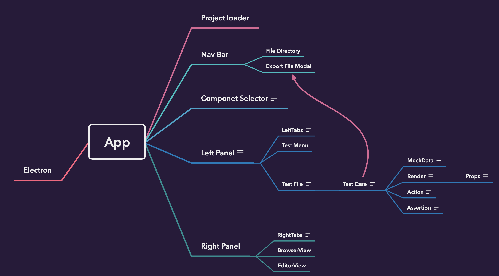
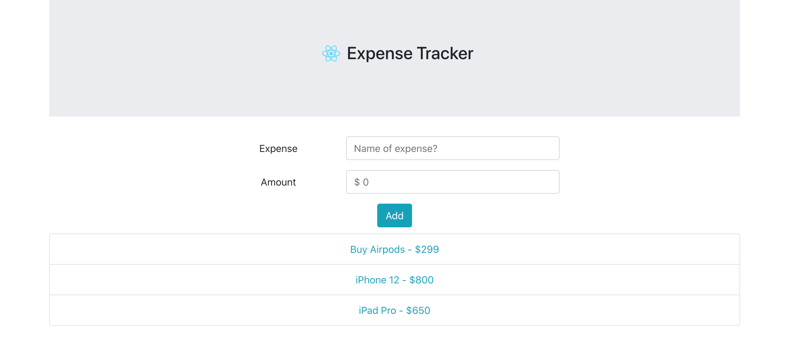
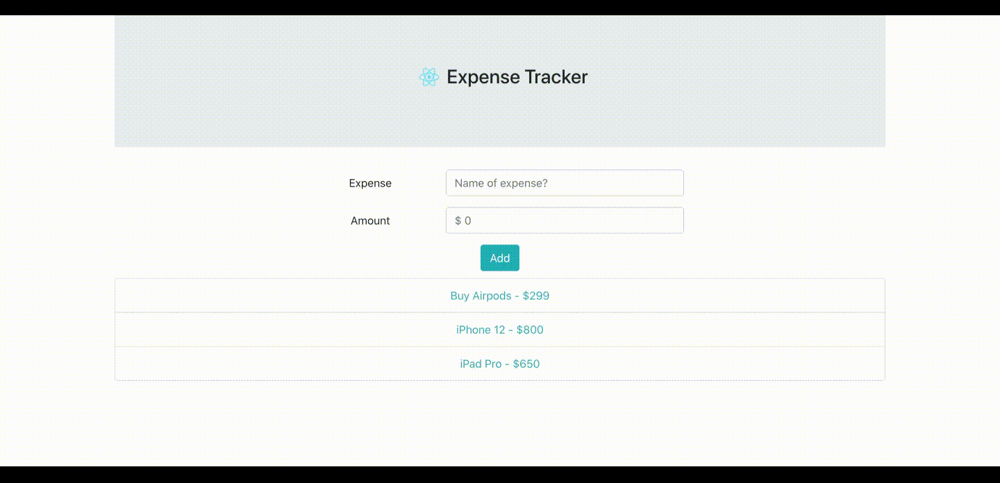

As far as we know Redux is one of the most popular open-source JavaScript library for managing application state. It is most commonly used with libraries such as React or Angular for building user interfaces. However, the learning curve for Redux pretty much takes a toll and not a lot of programmers find ecstacy while trying to learn Redux. It is considerably tough to understand and very tricky.

Nonetheless, the emergence of React Hooks API has pretty much unfolded a new way to deal with global states. Without any further due, we are going to look at how we can manage application level state using the Hooks API; useReducer and useContext API to be precise.

## Prerequisites

To follow along with the tutorial, please make sure you have the following dependencies installed on your system:

- Node.js version >= `12.x.x` installed
- npm or yarn package manager

Make sure you are on your desired directory (I'm on my desktop). Create the project folder (react-hooks-api in my case ) and run the `npx-create-react-app` command on your terminal to create a new react-app:

```bash
cd Desktop
mkdir react-hooks-api && cd react-hooks-api
npx create-react-app .
```

## State management in React

We have two different types of state to be handled in React. First, the component-level state, that only resides within a component. Second, the application-level state, that can be accessed or shared by multiple components.

With React's Context API, we can now implement global state without using any third-party global state management libraries like Redux. The `useReducer` hook makes it very easy to manage complex state objects and state transitions.

The notable advantage in using useReducer is that it can be used to handle sophisticated data structures or a state object that contains multiple values. It accepts a reducer function and an initial state, and it returns the actual state and a dispatch function. The dispatch function alters state in an implicit way by mapping actions to state transitions.

## Bootstrap Installation

We make use of Bootstrap to help us spin out UI components right off the bat without us having to code much. Install Bootstrap, Reactstrap and uuid running the following command on your terminal.

```bash
npm install bootstrap@4.5.0 reactstrap@8.5.1 uuid@8.2.0
```

- Bootstrap : For UI components
- Reactstrap : Easy to use React Bootstrap 4 components compatible with React 16+.
- UUID : A UUID (Universal Unique Identifier) is a 128-bit number used to uniquely identify some object or entity on the Interne

Once we are done with installing the dependencies open 'src/index.js' file inside your React project. Add an import statement to include the Bootstrap CSS file.

```javascript
// after other imports
import 'bootstrap/dist/css/bootstrap.min.css'
```

We now have Bootstrap up and running on our project.

## Defining a global state

Create a new file inside the src directory called `GlobalState.js`.

We now make use of React's Context API to incorporate a provider that will provide and make the state available to all the components across the React app.

```javascript
import React, { useReducer, createContext } from 'react'
import { v4 as uuid } from 'uuid'
```

Next, we create an empty context instance and altogether define the initial state object as well. The initial state has an expenses array that holds object of expenses (since this is an expense tracker app).

```javascript
export const ExpenseContext = createContext()

const initialState = {
  expenses: [
    {
      id: uuid(),
      name: 'Buy Airpods',
      amount: 299,
    },
  ],
}
```

Now we define another anonymous function called reducer. Reducer is going to take two arguments, one is the current state and the other one is the dispatched action. The reducer will update the state object of the React app depending upon the action type.

For the following example, the reducer function persists only one action type, that is to add an expense. With no changes or no modifications required the reducer function will return the current state by default.

```javascript
const reducer = (state, action) => {
  switch (action.type) {
    case 'ADD_EXPENSE':
      return {
        expenses: [...state.expenses, action.payload],
      }
    default:
      return {
        state,
      }
  }
}
```

Moving on, we now define an ExpenseContextProvider that behaves alike store, that holds the entire state tree of the React application.

```javascript
export const ExpenseContextProvider = props => {
  const [state, dispatch] = useReducer(reducer, initialState)

  return (
    <ExpenseContext.Provider value={[state, dispatch]}>
      {props.children}
    </ExpenseContext.Provider>
  )
}
```

The `useReducer` hook allows us to create a reducer using the reducer function we defined earlier. The `initialState` is then passed as a second argument.

## Wrap the App with the provider

Wrapping the `ExpenseContextProvider` around a component, will allow the component and its children to access the current state as well as modify the state object.

Now open, App.js file, and modify it as below.

```javascript
import React from 'react'
import { Container } from 'reactstrap'

import { ExpenseContextProvider } from './GlobalState'

import Header from './components/Header'
import Form from './components/Form'
import List from './components/List'

export default function App() {
  return (
    <ExpenseContextProvider>
      <Container className="text-center">
        <Header />
        <Form />
        <List />
      </Container>
    </ExpenseContextProvider>
  )
}
```

In the follwing sections, we will create the components that we have defined already in our App.js. Create a /components directory and then create three new component files like so:

- `Header.js`
- `Form.js`
- `List.js`

## App Header

We define a Header component which acts as a simple jumbotron component from Bootstrap All it does is it displays the title of the app and the logo.

Open `Header.js` and add the following snippet:

```javascript
import React from 'react'
import { Jumbotron } from 'reactstrap'
import Logo from '../logo.svg'

export default function Headers() {
  return (
    <Jumbotron fluid>
      <h3 className="display-6">
        
        Expense Tracker
      </h3>
    </Jumbotron>
  )
}
```

## Adding a form component

Inside `Form.js` file add the following line of imports.

```javascript
import React, { useState, useContext } from 'react'
import {
  Form as BTForm,
  FormGroup,
  Input,
  Label,
  Col,
  Button,
} from 'reactstrap'
import { v4 as uuid } from 'uuid'

import { ExpenseContext } from '../GlobalState'
```

We now go on to define a Form component that will access and modify values from ExpenseContext using useContext hook.

```javascript
export default function Form() {
  const [state, dispatch] = useContext(ExpenseContext)

  //...
}
```

Using the `useState` reducer, we define two local state variables. These state variables will help us define the controlled input fields. A controlled input field accepts its current value as a prop as well as a callback to change that value.

```javascript
const [name, setName] = useState('')
const [amount, setAmount] = useState('')
```

To update their values while a user is typing, we add the following handler methods. Both of these functions are going to retrieve the value from the corresponding field.

```javascript
const handleName = event => {
  console.log('Name ', event.target.value)
  setName(event.target.value)
}

const handleAmount = event => {
  console.log('Amount ', event.target.value)
  setAmount(event.target.value)
}
```

And finally, we have an onSubmit handler when the form is submitted, we call it handleSubmitForm. This method when triggered dispatches an action to add the expense (ADD_EXPENSE). This is exactly how the reducer function in the global state updates the state.

```javascript
const handleSubmitForm = event => {
  event.preventDefault()
  if (name !== '' && amount > 0) {
    dispatch({
      type: 'ADD_EXPENSE',
      payload: { id: uuid(), name, amount },
    })

    // clean input fields
    setName('')
    setAmount('')
  } else {
    console.log('Invalid expense name or the amount!')
  }
}
```

Now add the following JSX to display the form component.

```javascript
return (
  <BTForm style={{ margin: 10 }} onSubmit={handleSubmitForm}>
    <FormGroup
      className="row"
      style={{ alignItems: 'center', justifyContent: 'center' }}
    >
      <Label for="exampleEmail" sm={2}>
        Expense
      </Label>
      <Col sm={4}>
        <Input
          type="text"
          name="name"
          id="expenseName"
          placeholder="Name of expense?"
          value={name}
          onChange={handleName}
        />
      </Col>
    </FormGroup>
    <FormGroup
      className="row"
      style={{ alignItems: 'center', justifyContent: 'center' }}
    >
      <Label for="exampleEmail" sm={2}>
        Amount
      </Label>
      <Col sm={4}>
        <Input
          type="number"
          name="amount"
          id="expenseAmount"
          placeholder="$ 0"
          value={amount}
          onChange={handleAmount}
        />
      </Col>
    </FormGroup>
    <Button type="submit" color="info">
      Add
    </Button>
  </BTForm>
)
```

## Displaying list of items

Let's move on to add the final List.js component to display a list of items from the current state object provided by the ExpenseContext.

Please add on the following import statements to carry on:

```javascript
import React, { useContext } from 'react'
import { ListGroup, ListGroupItem } from 'reactstrap'

import { ExpenseContext } from '../GlobalState'
```

Next, map the state value to display the name of the expenses and the amount of the expense as a list item.

```javascript
export default function List() {
  const [state] = useContext(ExpenseContext)
  return (
    <ListGroup style={{ color: '#17A2B8' }}>
      {state.expenses.map(item => {
        return (
          <ListGroupItem key={item.id}>
            {item.name} - ${item.amount}
          </ListGroupItem>
        )
      })}
    </ListGroup>
  )
}
```

## Running the application

We are done implementing all the components of our Expense Tracker app. Now, let's run the app and see it in action. On the initial render, the Rect app is going to look something like we see below:



And we have an animated gif displaying the working of the app as follows.
It displays the only expense item defined in the initial state. Try adding a new item in the list by filling up the form.



## Conclusion

We are finally done implementing a basic Expense Tracker App. With this we have a deeper understanding of how Context API can help us manage application level state. Context provides a way to share values between multiple components without having to explicitly pass a prop through every level of the tree.
