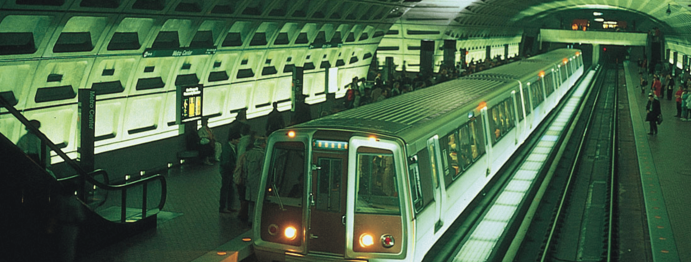
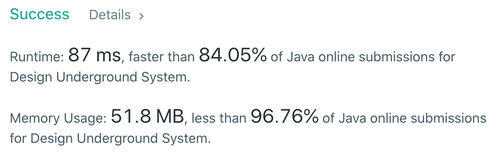

## Problem Statement

**Implement the class "UndergroundSystem" that supports three methods:**

1. checkIn(int id, string stationName, int t)

```
- A customer with id card equal to id, gets in the station stationName at time t.
- A customer can only be checked into one place at a time.
```

<br/>

2. checkOut(int id, string stationName, int t)

```
- A customer with id card equal to id, gets out from the station stationName at time t.
```

<br/>

3.  getAverageTime(string startStation, string endStation)

```
- Returns the average time to travel between the startStation and the endStation.
- The average time is computed from all the previous traveling from startStation to endStation that happened directly.
- Call to getAverageTime is always valid.
- You can assume all calls to checkIn and checkOut methods are consistent. That is, if a customer gets in at time t1 at some station, then it gets out at time t2 with t2 > t1. All events happen in chronological order.
```

### Example 1:

#### Input:

```bash
["UndergroundSystem","checkIn","checkIn","checkIn","checkOut","checkOut","checkOut","getAverageTime","getAverageTime","checkIn","getAverageTime","checkOut","getAverageTime"][],[45,"Leyton",3],[32,"Paradise",8],[27,"Leyton",10],[45,"Waterloo",15],[27,"Waterloo",20],[32,"Cambridge",22],["Paradise","Cambridge"],["Leyton","Waterloo"],[10,"Leyton",24],["Leyton","Waterloo"],[10,"Waterloo",38],["Leyton","Waterloo"]]
```

#### Output

```bash
[null,null,null,null,null,null,null,14.00000,11.00000,null,11.00000,null,12.00000]
```

#### Explanation

```bash
UndergroundSystem undergroundSystem = new UndergroundSystem();
undergroundSystem.checkIn(45, "Leyton", 3);
undergroundSystem.checkIn(32, "Paradise", 8);
undergroundSystem.checkIn(27, "Leyton", 10);
undergroundSystem.checkOut(45, "Waterloo", 15);
undergroundSystem.checkOut(27, "Waterloo", 20);
undergroundSystem.checkOut(32, "Cambridge", 22);
undergroundSystem.getAverageTime("Paradise", "Cambridge"); // return 14.00000. There was only one travel from "Paradise" (at time 8) to "Cambridge" (at time 22)
undergroundSystem.getAverageTime("Leyton", "Waterloo"); // return 11.00000. There were two travels from "Leyton" to "Waterloo", a customer with id=45 from time=3 to time=15 and a customer with id=27 from time=10 to time=20. So the average time is ( (15-3) + (20-10) ) / 2 = 11.00000
undergroundSystem.checkIn(10, "Leyton", 24);
undergroundSystem.getAverageTime("Leyton", "Waterloo"); // return 11.00000
undergroundSystem.checkOut(10, "Waterloo", 38);
undergroundSystem.getAverageTime("Leyton", "Waterloo"); // return 12.00000
```

Example 2:

#### Input

```bash
["UndergroundSystem","checkIn","checkOut","getAverageTime","checkIn","checkOut","getAverageTime","checkIn","checkOut","getAverageTime"][],[10,"Leyton",3],[10,"Paradise",8],["Leyton","Paradise"],[5,"Leyton",10],[5,"Paradise",16],["Leyton","Paradise"],[2,"Leyton",21],[2,"Paradise",30],["Leyton","Paradise"]]
```

#### Output

```bash
[null,null,null,5.00000,null,null,5.50000,null,null,6.66667]
```

#### Explanation

```bash
UndergroundSystem undergroundSystem = new UndergroundSystem();
undergroundSystem.checkIn(10, "Leyton", 3);
undergroundSystem.checkOut(10, "Paradise", 8);
undergroundSystem.getAverageTime("Leyton", "Paradise"); // return 5.00000
undergroundSystem.checkIn(5, "Leyton", 10);
undergroundSystem.checkOut(5, "Paradise", 16);
undergroundSystem.getAverageTime("Leyton", "Paradise"); // return 5.50000
undergroundSystem.checkIn(2, "Leyton", 21);
undergroundSystem.checkOut(2, "Paradise", 30);
undergroundSystem.getAverageTime("Leyton", "Paradise"); // return 6.66667
```

**_Constraints:_**

- There will be at most 20000 operations.
- 1 <= id, t <= 10^6
- All strings consist of uppercase, lowercase English letters and digits.
- 1 <= stationName.length <= 10
- Answers within 10^-5 of the actual value will be accepted as correct.

## Problem Breakdown

So we need to design an underground station system that does three different things for us:

- First, it would check a person into the station.
- Second, it would check a person out of the station.
- Third, it would calculate the average time between checkin and checkout by a person.

We are given the following method signatures:

```bash
- checkIn() -> that accepts an unique 'ID' of the customer, the 'stationName' they checked into, and the time 't' denotes the time when they checked-in. (Note: Each customer can only be checked at one station at a time.)
```

```bash
- checkOut() -> that accepts an unique 'ID' of the customer, the 'stationName' they checked out from, and the time 't' denotes the time when they checked-out.
```

```bash
- getAverageTime() -> returns the average time between checking-in and checking-out, or average time to travel between two stations.
```

So finally we need to design a class that does all of the mentioned. Let us implement the code and run through it so we understand what's going on.

## Implementation (Java Code)

> Heavy comments upcoming to precisely understand what goes through each step

We have used a "HashMap" to keep track of checking-in and checking-out a customer. We have also used another "HashMap" that creates a unique key using a DELIMETER to calculate the average travel time between two stations.

The two HashMaps will be structured like so:

```bash
Map<id, (id, station, t)> arrivals;
Map<names, (total, count)> averages;
```

#### `TIME - O(1)` | `SPACE - O(M+N)`

```java
class UndergroundSystem {

    // delimeter for start and end station
    private final String DELIMETER = ",";

    private Map<Integer, Event> arrivals;
    private Map<String, Average> averages;

    public UndergroundSystem() {

        // create two maps
        // one for arrivals and the other for averages
        arrivals = new HashMap<>();
        averages = new HashMap<>();

    }

    public void checkIn(int id, String stationName, int t) {
        // key value pair stored in the arrivals
        // stores the id of the customer and its event
        // Map<123, (123, Boston, 5)> arrivals;
        arrivals.put(id, new Event(id, stationName, t));
    }

    public void checkOut(int id, String stationName, int t) {
        // pull out the customer that checks out
        // Map<123, (123, Boston, 5)>
        Event arrivalEvent = arrivals.get(id);
        // remove the arrivals since they already checked out
        arrivals.remove(id);
        // Map<> arrivals;

        // compute the time between checkin and checkout
        int diff = t - arrivalEvent.time;

        // compute the key using the delimeter
        // key -> (startStation, finalStation)
        String key = arrivalEvent.stationName + DELIMETER + stationName;

        // use the above computed key to find the average
        // but there may be chances that this key is not already in our map
        // so we need to perform an extra edge case here

        Average average = averages.containsKey(key) ? averages.get(key) : new Average();
        average.updateAverage(diff);

        // add it to the map
        averages.put(key, average);
    }

    public double getAverageTime(String startStation, String endStation) {
        // compute the key once again
        String key = startStation + DELIMETER + endStation;
        return averages.get(key).getAverage();
    }

    class Event {
        public int id;
        public String stationName;
        public int time;

        public Event(int id, String stationName, int time){
            this.id = id;
            this.stationName = stationName;
            this.time = time;
        }
    }

    class Average {
        public double total = 0;
        public int count = 0;

        // update average count
        // average map -> Average<total, count>
        // total -> time taken between checkin and checkout between stations
        // count -> no. of customers through that station
        public void updateAverage(int diff){
            ++count;
            total += diff;
        }

        // return the average
        public double getAverage(){
            return total / count;
        }
    }
}

/**
 * Your UndergroundSystem object will be instantiated and called as such:
 * UndergroundSystem obj = new UndergroundSystem();
 * obj.checkIn(id,stationName,t);
 * obj.checkOut(id,stationName,t);
 * double param_3 = obj.getAverageTime(startStation,endStation);
 */
```

Time Complexity of the implemented code is `O(1)` since inserting, removing an accessing in a HashMap are all constant time operations. While, the space complexity is `O(M+N)`, where, 'N' is the number of arrivals and 'M' is the number of averages.

Note, 'N' increases when customers that checks in doesn't checkouts out and 'M' increases when a customer checks out, and therefore we need to include both of them together.

## Submission Details


