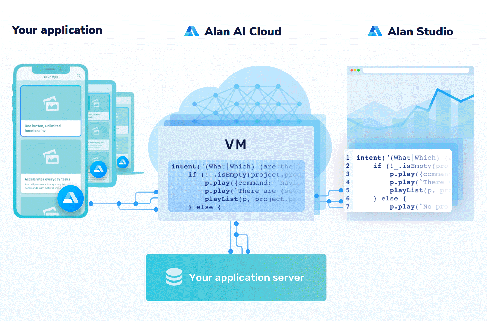

## What is Alan AI?

Alan Conversational Voice AI platform that allows you to create a voice interface for applications and webpages. Alan makes it easy to develop machine learning models, train the speech recognition software and you don't have to bother about hosting your solution at all.

Alan takes care of all voice-related tasks, so you can quickly build a voice assistant for your application that does all the trick, with minimal changes to the existing UI and workflows.

With Alan, you can create scripts (written in JavaScript) to build a voice interface for any kind of application. These scripts has unlimited voice functionality. Alan can also integrate well with iOS, Android and web solutions, as well as cross-platform frameworks like Flutter and Ionic.

## How can you work with Alan?

The Alan platform offers the following components, as an environment of interaction:

- Alan Studio
- Alan SDKs
- Alan Cloud

 

 

### 🤖 Alan Studio:

- The Alan Studio is an environment where developers can write voice scripts for their applications.

- The Alan Studio provides number of tools for convenient and easy scripting, debugging and testing.

 

### 🤖 Alan SDKs:

- Alan makes it easy for your application to execute voice commands from scripts. You just need to add the Alan button onto your application using the Alan SDK.

- Upon integration, a small button pops up on the application UI. That is the Alan button which activates the voice interface and indicates the processing state.

 

### 🤖 Alan Cloud:

- With Alan, you do not need to plan for and deploy servers and other IT infrastructure to run voice scripts. The solution architecture is serverless: voice scripts are run on virtual machines in the cloud managed for you.

- Alan is highly scalable. It can scale up to millions of users as your requirements grow.

- All resources to scale the essential workloads are all automatically provisioned by Alan.

 

To know more about Alan visit the links below.

⦾ [Official Documentation.](https://alan.app/docs/usage/getting-started)  
⦾ [Official Website.](https://alan.app/)  
⦾ [Next Gen UX with Voice AI.](https://www.youtube.com/channel/UCrsg0b32nL6L2j5jG7uxOuw)  
