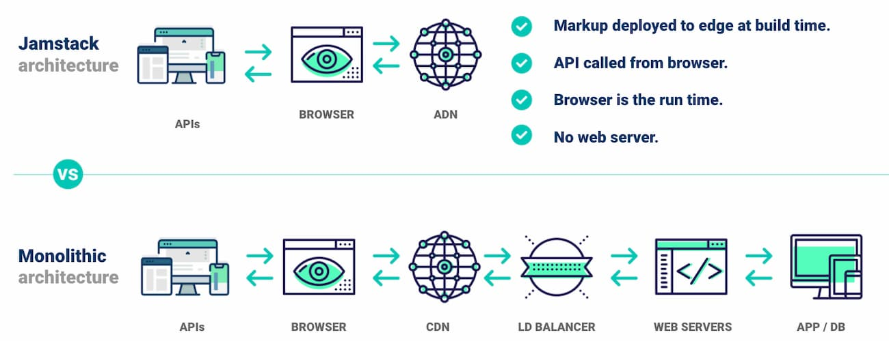

## What is JAMStack?

Jamstack is an architecture for fast, secure, and scalable development. Built on top of tools and workflows that boosts productivity to a whole new level.

JAM stands for JavaScript, API & Markup.

> "A modern web development architecture based on client-side JavaScript, reusable APIs, and prebuilt Markup" — Mathias Biilmann (CEO & Co-founder of Netlify).

### Why we might need JAMStack?

- Traditional legacy web is run by complex applications and servers.
- A traditional website may have to run on a server at all times.
- Running and displaying sites retrieved from the server may needlessly slows things down.
- It enables opportunities for web attacks, and is relatively expensive to scale.

## Components of JAMStack

### JavaScript

Dynamic functionalities are handled by JavaScript. There is no restriction on which framework or library you must use.

### APIs

Backend operations are abstracted into reusable APIs and accessed through HTTPS from the client. These can be third party services or a custom function.

### Markup

Websites are served as static HTML files. These can be generated from source files, such as Markdown, using a Static Site Generator like Next.js.

## Why JAMStack ?

A Jamstack architecture can bring all sorts of benefits to the sites and to project workflows. Some of the key benfits are:

### Security

- The Jamstack mitigates the need for servers and systems to ossify against attack.

- Serving pages and assets as pre-generated files allows read-only hosting, reducing attack vectors .

### Scalability

- Jamstack can deal with heavy traffic loads using logic for caching resources. Sites are served entirely from a CDN and there is no complex logic or workflow to determine what assets can be cached and when.

- Jamstack sites can be cached inside a CDN enabling simpler deployments, built-in redundancy and increased load capacity.

### Performance

- Page loading speeds have an impact on user experience and conversion rates. Jamstack sites remove the need to generate page views on a server at request time through pre-generating pages during the build.

- With all the pages already available on a CDN ready to be served; high performance is met without introducing expensive or complex infrastructure.

### Developer Experience

- Jamstack sites can be built with a wide variety of tools. They do not depend on the proprietary technologies or exotic and little known frameworks.

## How it works?

### 1. Decoupling the frontend from the backend:

Unlike the legacy apps, Jamstack projects separates the frontend pages from the backend and the database. Free from backend servers, the frontend can then be deployed globally, directly to a CDN.

### 2. Prebuilding all pages for speed

Before deployment, the entire front end is pre-built into highly optimized static pages and assets. This happens in a build process (before being deployed / hosted).

### 3. Dynamic content via APIs

The global front-end uses Javascript and APIs to talk to a backend service, allowing pages to be enhanced and personalized on the fly.

## Conclusion

Very new yet promising, Jamstack is all over the development world right now. The catch is, everybody wants their website to be blazing fast, secured, and maintanable at the highest level. And, Jamstack has been promising to do just that. Build on widely available tools and very popular amongst the developers, it's not hard to find enthusiastic and talented developers wanting to build with the Jamstack. I will support the movement while you should too.

Support the global community by being a part of the [movement](https://jamstack.org/community/).
